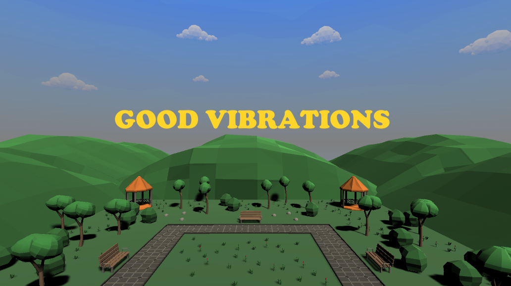

<h1 align="center">Gesture Based UI Development</h1>

<a href="https://www.gmit.ie/" >

</a>

#### John Shields - G00348436

***

# Project Details
| **Project Title** | Good Vibrations |
| :------------- |:-------------|
| **Course**              | BSc (Hons) in Software Development |
| **Module**              | Gesture Based UI Development |
| **Institute**           | [Galway-Mayo Institute of Technology](https://www.gmit.ie/) |
| **Student**             | [John Shields](https://github.com/johnshields) |
| **Module Lecturer**      | Damien Costello |

***

Preview

 

# About the Game
Good Vibrations is a Mixed Reality Game that allows the user to control the game using voice commands, keyboard, and mouse.
The player plays as a dog in the game and collects bones around the vibrant park setting filled with other dogs and their owners.
The game has upbeat music that fits the setting and is credited [here](https://github.com/johnshields/GoodVibrations-MR-Game/blob/main/workings/music_credits.md). Once all the bones are
collected, the game ends and loads back to the Main Menu.

* Developed with Unity ``2020.1.17f1`` and JetBrains Rider ``2020.3.3``

***

### [Play the Game!](https://developer.cloud.unity3d.com/share/share.html?shareId=-JE_DK3nT8) ``Windows 64-Bit``

`Note:` Requires `English (US)` selected for computer speech settings.

***

# Controls :loudspeaker:
## Main Menu
Voice commands are optional the UI buttons can be used too.

These voice commands can be followed with `"the game"`
* Start the game
    * start, play, begin or continue
    * lets play, lets start, lets begin or lets continue
    * I want to play, start, begin or continue
    * I would like to play, start, begin or continue
* Exit the game
    * exit, quit or close

## In-Game
#### Dog Controls
These voice commands can be followed with ``"dog"``, `"boy"` or `"girl"`
* Idle
   * be idle, yield, stop or halt
* Sit  
  * sit, rest relax or control yourself
* Walk
  * walk, go, stroll or wander
  * start or begin walking
  * start or begin strolling
  * start or begin wandering
* Run
  * run, jog, or dash
  * start or begin running
  * start or begin jogging
  * start or begin dashing
  * run, jog or dash around

* Turn the Dog using the `Mouse`
* Use the `Space Bar` to Jump

#### Pause Menu
Use ``Esc`` to pause the game

Voice commands are optional the UI buttons can be used too.

These voice commands can be followed with `"the game"`
* resume or go back
* take me back to the game

###### Back to the Main Menu
* main menu
* go home
* back to main menu
* back to the main menu
* bring up the main menu

***
###### END OF README
